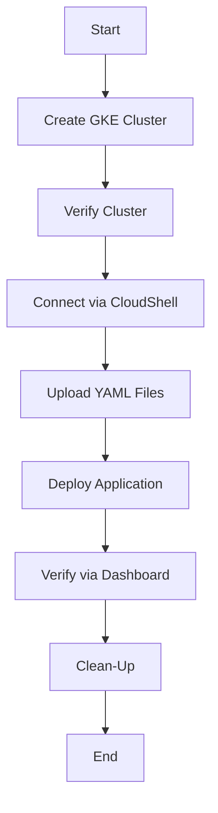

## **Title:** GCP Google Kubernetes Engine - Create GKE Cluster

### **Description:** Learn to create Google Kubernetes Engine (GKE) Cluster, deploy a sample application, test, and clean up resources.

---

## 🗂️ **Process Overview**

| Step No. | Activity                    | Description                                              | Responsible     | Tools / Commands  |
| -------- | --------------------------- | -------------------------------------------------------- | --------------- | ----------------- |
| 01       | Introduction                | Overview of GKE Cluster creation & sample app deployment | DevOps Engineer | GCP Console       |
| 02       | Create Standard GKE Cluster | Create GKE cluster using GCP Console                     | DevOps Engineer | GCP UI            |
| 03       | Verify Cluster Details      | Validate cluster configuration & components              | DevOps Engineer | GCP Console       |
| 04       | Verify Additional Features  | Check GKE system workloads, services, secrets, storage   | DevOps Engineer | GCP Console       |
| 05       | Connect via CloudShell      | Connect to GKE Cluster using `kubectl`                   | DevOps Engineer | Google CloudShell |
| 06–07    | Review Sample App Files     | Review deployment & service manifests                    | DevOps Engineer | YAML Files        |
| 08       | Upload Files                | Upload manifests to CloudShell                           | DevOps Engineer | CloudShell        |
| 09       | Deploy Sample App           | Deploy and verify workload & service                     | DevOps Engineer | `kubectl`         |
| 10–13    | Verify via Dashboard        | Review workloads, services, load balancer                | DevOps Engineer | GCP Console       |
| 14       | Clean-Up                    | Delete deployment & service                              | DevOps Engineer | `kubectl`         |

---

## 🌳 **Process Hierarchy Diagram**

```
GKE Cluster Setup SOP
│
├── Step 01: Introduction
│
├── Step 02: Create Standard GKE Cluster
│   ├── Cluster Basics
│   ├── Node Pool Configuration
│   ├── Cluster Settings
│   └── Create Cluster
│
├── Step 03: Verify Cluster Details
│
├── Step 04: Verify GKE Features
│   ├── Workloads
│   ├── Services & Ingress
│   ├── Applications / Secrets / ConfigMaps
│   ├── Storage
│   └── Backup & Security
│
├── Step 05: Connect via CloudShell
│
├── Step 06–07: Review YAML Manifests
│
├── Step 08: Upload Files
│
├── Step 09: Deploy and Verify Application
│
├── Step 10–13: Dashboard Verification
│
└── Step 14: Clean-Up
```

---

## ⚙️ **Detailed SOP Steps**

### **Step-01: Introduction**

* Create GKE Standard GKE Cluster
* Configure Google CloudShell to access GKE Cluster
* Deploy simple Kubernetes Deployment and Load Balancer Service
* Clean-Up

---

### **Step-02: Create Standard GKE Cluster**

| Section              | Setting           | Value                                         |
| -------------------- | ----------------- | --------------------------------------------- |
| **Cluster Basics**   | Name              | `standard-public-cluster-1`                   |
|                      | Location Type     | Regional                                      |
|                      | Region            | `us-central1`                                 |
|                      | Node Locations    | `us-central1-a, us-central1-b, us-central1-c` |
|                      | Release Channel   | Rapid                                         |
|                      | Version           | Latest available                              |
| **Node Pool**        | Name              | `default-pool`                                |
|                      | Nodes per zone    | 1                                             |
|                      | Machine Type      | `e2-small`                                    |
|                      | Image Type        | Container-Optimized OS                        |
|                      | Boot Disk Size    | 20 GB                                         |
|                      | Enable Spot VMs   | ✅ Checked                                     |
| **Cluster Settings** | Dataplane V2      | ✅ Enabled                                     |
|                      | Workload Identity | ✅ Enabled                                     |

> **Action:**
> Go to **Kubernetes Engine → Clusters → CREATE → GKE Standard → CONFIGURE**
> Configure as above and click **CREATE**

---

### **Step-03: Verify Cluster Details**

* GCP Console → Kubernetes Engine → Clusters → `standard-public-cluster-1`

  * **Details Tab:** Review configuration
  * **Nodes Tab:** Review Compute Engine nodes
  * **Storage Tab:** Review Storage Classes
  * **Logs Tab:** Check logs and filter by severity

---

### **Step-04: Verify Additional Features**

| Section              | GKE Console Path                                    | Action                                          |
| -------------------- | --------------------------------------------------- | ----------------------------------------------- |
| Workloads            | Clusters → Workloads → Show System Workloads        | Review system pods                              |
| Services & Ingress   | Clusters → Services & Ingress → Show System Objects | Review services                                 |
| Secrets & ConfigMaps | Clusters → Secrets & ConfigMaps                     | Verify                                          |
| Storage              | Clusters → Storage Classes                          | Check `premium-rwo`, `standard`, `standard-rwo` |
| Others               | Backup, Protect, Config Management                  | Review                                          |

---

### **Step-05: Connect via Google CloudShell**

#### Commands:

```t
# Verify gke-gcloud-auth-plugin Installation (if not installed, install it)
gke-gcloud-auth-plugin --version 

# Install Kubectl authentication plugin for GKE
sudo apt-get install google-cloud-sdk-gke-gcloud-auth-plugin

# Verify gke-gcloud-auth-plugin Installation
gke-gcloud-auth-plugin --version 

# Configure kubeconfig for kubectl
gcloud container clusters get-credentials <CLUSTER-NAME> --region <REGION> --project <PROJECT-NAME>
gcloud container clusters get-credentials standard-public-cluster-1 --region us-central1 --project *****


# Run kubectl with the new plugin prior to the release of v1.25
vi ~/.bashrc
USE_GKE_GCLOUD_AUTH_PLUGIN=True

# Reload the environment value
source ~/.bashrc

# Check if Environment variable loaded in Terminal
echo $USE_GKE_GCLOUD_AUTH_PLUGIN

# Verify kubectl version
kubectl version --short

# Install kubectl (if not installed)
gcloud components install kubectl

# Configure kubectl
gcloud container clusters get-credentials <CLUSTER-NAME> --zone <ZONE> --project <PROJECT-ID>
gcloud container clusters get-credentials standard-cluster-1 --zone us-central1-c --project kdaida123

# Verify Kubernetes Worker Nodes
kubectl get nodes

# Verify System Pod in kube-system Namespace
kubectl -n kube-system get pods

# Verify kubeconfig file
cat $HOME/.kube/config
kubectl config view
```

---

### **Step-06 & Step-07: Review Sample Application Files**

| File Name                                 | Kind       | Description                       |
| ----------------------------------------- | ---------- | --------------------------------- |
| `01-kubernetes-deployment.yaml`           | Deployment | Creates two replicas of Nginx pod |
| `02-kubernetes-loadbalancer-service.yaml` | Service    | Exposes app using LoadBalancer    |

---

### **Step-08: Upload Sample App to CloudShell**

```t
# Upload Folder -> google-kubernetes-engine
cd google-kubernetes-engine/02-Create-GKE-Cluster
ls kube-manifests/
cat kube-manifests/01-kubernetes-deployment.yaml
cat kube-manifests/02-kubernetes-loadbalancer-service.yaml
```
---

### **Step-09: Deploy Sample Application**

#### **Commands Executed:**

```bash
<GENERIC-USER>@cloudshell:~/gke-handon$ kubectl apply -f kube-manifests/
deployment.apps/myapp1-deployment created
service/myapp1-lb-service created
```

✅ **Result:**
Deployment and Service created successfully.

---

### **Verify Deployment**

```bash
<GENERIC-USER>@cloudshell:~/gke-handon$ kubectl get deploy
NAME                READY   UP-TO-DATE   AVAILABLE   AGE
myapp1-deployment   2/2     2            2           22s
```

✅ **Result:**
Deployment is up with 2 replicas running successfully.

---

### **Verify Service**

```bash
<GENERIC-USER>@cloudshell:~/gke-handon$ kubectl get svc
NAME                TYPE           CLUSTER-IP         EXTERNAL-IP        PORT(S)        AGE
kubernetes          ClusterIP      <GENERIC-CLUSTER-IP>   <none>         443/TCP        4h40m
myapp1-lb-service   LoadBalancer   <GENERIC-CLUSTER-IP>   <GENERIC-EXTERNAL-IP>   80:32062/TCP   36s
```

✅ **Result:**
LoadBalancer assigned an **external IP** successfully — app accessible via `http://<GENERIC-EXTERNAL-IP>`.

---

### **Verify Pods**

```bash
<GENERIC-USER>@cloudshell:~/gke-handon$ kubectl get pods
NAME                                 READY   STATUS    RESTARTS   AGE
myapp1-deployment-556b469d69-cswk9   1/1     Running   0          3m3s
myapp1-deployment-556b469d69-tvn2j   1/1     Running   0          3m3s
```

✅ **Result:**
Two pods created and running without restarts.

---

### **Step-14: Clean-Up**

```bash
<GENERIC-USER>@cloudshell:~/gke-handon$ kubectl delete -f kube-manifests/
deployment.apps "myapp1-deployment" deleted
service "myapp1-lb-service" deleted
```

✅ **Result:**
All deployed resources deleted successfully.

---

### **Post-Cleanup Verification**

```bash
<GENERIC-USER>@cloudshell:~/gke-handon$ kubectl get deploy
No resources found in default namespace.

<GENERIC-USER>@cloudshell:~/gke-handon$ kubectl get svc
NAME         TYPE        CLUSTER-IP   EXTERNAL-IP   PORT(S)   AGE
kubernetes   ClusterIP   <GENERIC-CLUSTER-IP>   <none>   443/TCP   4h40m
```

✅ **Result:**
Only default Kubernetes service remains — environment cleaned up.


### **Step-10 to Step-13: Verify in GKE Dashboard**

| Section       | GCP Console Path                       | Verification               |
| ------------- | -------------------------------------- | -------------------------- |
| Workloads     | Kubernetes Engine → Workloads          | Review `myapp1-deployment` |
| Services      | Kubernetes Engine → Services & Ingress | Review `myapp1-lb-service` |
| Load Balancer | Networking Services → Load Balancing   | Review configuration       |

---

### **Step-14: Clean-Up**

```t
kubectl delete -f kube-manifests/
kubectl get deploy
kubectl get pod
kubectl get svc
```

---

## 🧩 **High-Level Process Flow**



---

## ✅ **SOP Summary Table**

| Phase             | Objective          | Key Output                         |
| ----------------- | ------------------ | ---------------------------------- |
| **Setup**         | Create GKE Cluster | Cluster provisioned successfully   |
| **Configuration** | Verify and connect | Authenticated CloudShell access    |
| **Deployment**    | Deploy sample app  | Running pods & external IP         |
| **Verification**  | Validate resources | Load balancer & workloads verified |
| **Clean-Up**      | Delete resources   | Environment reset                  |

---

